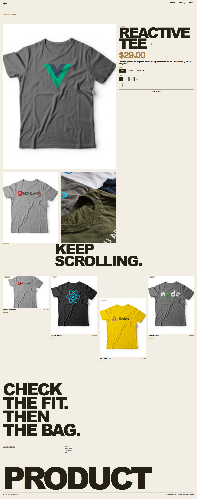
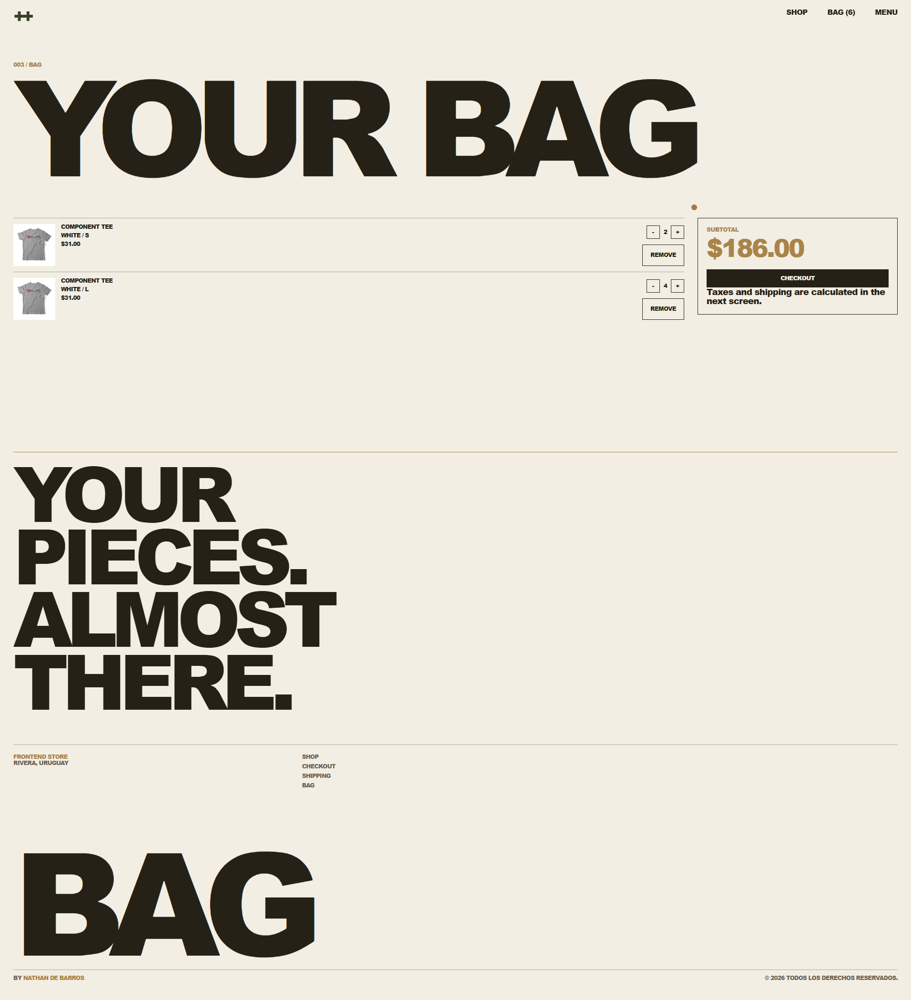
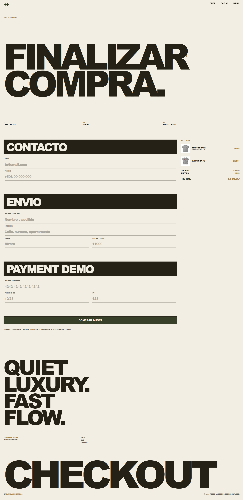
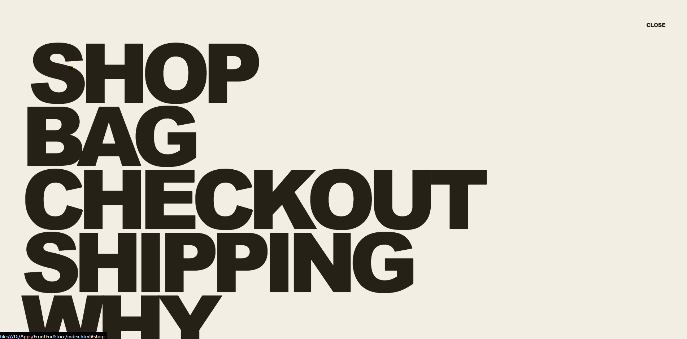

# FrontEnd Store

E-commerce editorial desarrollado con **HTML, CSS y JavaScript vanilla**, construido como una experiencia premium de apparel: grilla asimetrica, producto dinamico, carrito persistente, checkout demo y una direccion visual cuidada.

Proyecto creado por [Nathan de Barros](https://nathandebarros.com) como pieza de portfolio frontend y base open source para tiendas estaticas modernas.


## Demo visual

| Shop editorial | Producto | Checkout |
| --- | --- | --- |
|  |  |  |



## Que construye este proyecto

FrontEnd Store transforma un catalogo estatico tradicional en una tienda online completa, sin frameworks ni dependencias pesadas. La interfaz esta pensada para verse como una marca editorial contemporanea: tipografia de alto impacto, paleta premium, imagen hero con overlay, navegacion minima, microinteracciones y una experiencia de compra clara.

## Features

- Home/shop editorial con hero tipografico y grilla asimetrica.
- Catalogo renderizado desde JavaScript.
- Pagina de producto con variantes de color, talle y cantidad.
- Carrito persistente con `localStorage`.
- Checkout demo con resumen, subtotal, envio y total.
- Menu overlay full screen.
- Loader inicial, reveal on scroll y hovers suaves.
- Responsive real para desktop, tablet y mobile.
- Rutas preservadas para compatibilidad (`productos.html`, `nosotros.html`).
- Footer con firma profesional y licencia open source.

## Stack

- HTML5
- CSS3 moderno
- JavaScript vanilla
- `localStorage`
- CSS Grid
- Flexbox
- IntersectionObserver

Sin React, sin Bootstrap, sin Tailwind, sin build step.

## Estructura

```txt
.
├── index.html
├── product.html
├── bag.html
├── checkout.html
├── shipping.html
├── productos.html
├── nosotros.html
├── css/
│   ├── normalize.css
│   ├── style.css
│   └── styles.css
├── js/
│   └── app.js
├── img/
│   ├── hero.png
│   └── productos e imagenes existentes
└── capturas/
    ├── FrontEndStore-1.png
    ├── FrontEndStore-2.png
    ├── FrontEndStore-3.png
    ├── FrontEndStore-4.png
    └── FrontEndStore-5.png
```

## Como verlo localmente

Este proyecto es 100% estatico. Se puede abrir directamente:

```txt
index.html
```

Tambien podes servirlo con cualquier servidor estatico:

```bash
npx serve .
```

## Flujo de compra

1. Entrar al shop desde `index.html`.
2. Abrir cualquier producto.
3. Elegir color, talle y cantidad.
4. Agregar al bag.
5. Revisar cantidades en `bag.html`.
6. Finalizar en `checkout.html`.

El checkout es demostrativo: no envia datos y no procesa pagos reales.

## Decisiones tecnicas

### JavaScript sin framework

La logica vive en `js/app.js` para mantener el proyecto portable y facil de entender. El catalogo, la pagina de producto, el bag y el checkout se renderizan con funciones pequeñas y datos locales.

### Carrito persistente

El bag usa `localStorage`, por lo que los productos agregados se mantienen al recargar la pagina.

### CSS editorial

El sistema visual esta centralizado en `css/styles.css` con custom properties, grillas asimetricas, estados responsive y componentes reutilizables.

### Accesibilidad basica

El proyecto usa botones para acciones, links para navegacion, textos alternativos en imagenes, `:focus-visible` y soporte para `prefers-reduced-motion`.

## Sobre el developer

Soy **Nathan de Barros**, developer enfocado en construir interfaces web con identidad visual, buen criterio frontend y experiencias listas para convertirse en productos reales.

Este proyecto muestra:

- capacidad para reconstruir un frontend completo desde una direccion visual;
- manejo de HTML semantico, CSS avanzado y JavaScript vanilla;
- criterio para crear componentes reutilizables sin sobreingenieria;
- foco en experiencia de usuario, responsive y microinteracciones;
- cuidado por la presentacion final del proyecto.

Portfolio: [nathandebarros.com](https://nathandebarros.com)

## Roadmap posible

- Integrar backend real de productos.
- Agregar filtros y busqueda.
- Conectar checkout a una pasarela de pagos.
- Agregar panel de administracion.
- Optimizar imagenes para produccion.
- Sumar tests de UI.

## Licencia

Este proyecto esta publicado bajo licencia MIT. Podes usarlo, modificarlo y adaptarlo libremente.

Ver [LICENSE](LICENSE).

---

By [Nathan de Barros](https://nathandebarros.com)  
© 2026 Todos los derechos reservados.
